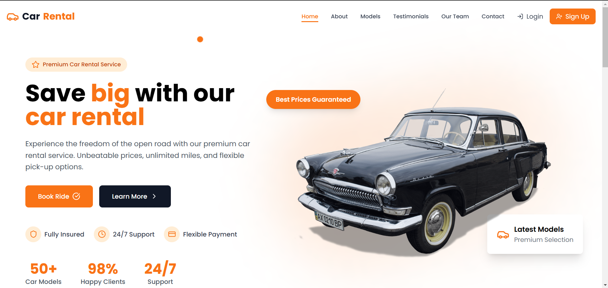
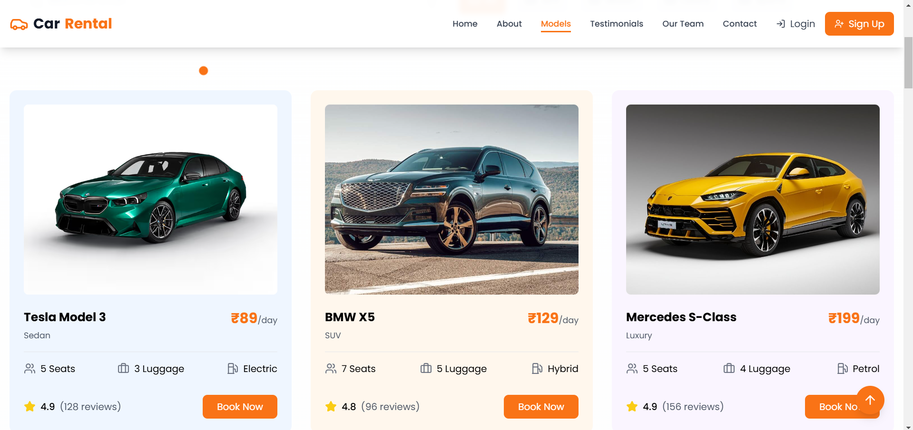
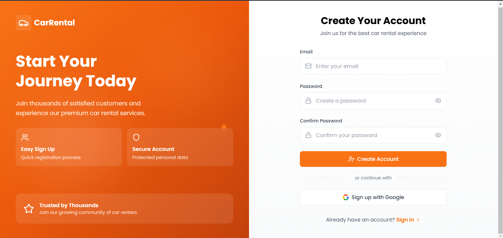

# Car Rental 

Welcome to the Car Rental  project! This application allows users to rent cars easily and efficiently. It provides a user-friendly interface for both customers and administrators to manage car rentals.

## This project is now OFFICIALLY accepted for

- 

## Table of Contents

- [Features](#features)
- [Preview](#preview)
- [Technologies Used](#technologies-used)
- [Installation](#installation)
- [Usage](#usage)
- [Supabase Backend Setup](#supabase-backend-setup)

## 🚀 Supabase Backend Setup

This project includes comprehensive documentation for setting up the Supabase backend automatically:

- **[QUICK_START.md](./QUICK_START.md)** - Quick 3-step guide to get started
- **[SUPABASE_ASSISTANT_PROMPT.md](./SUPABASE_ASSISTANT_PROMPT.md)** - Complete prompt for AI-assisted backend generation
- **[SUPABASE_ASSISTANT_GUIDE_TH.md](./SUPABASE_ASSISTANT_GUIDE_TH.md)** - Full guide in Thai language
- **[README_SPEC.md](./README_SPEC.md)** - Database schema specification and version tracking
- **[SUPABASE.md](./SUPABASE.md)** - Best practices for Supabase integration

**Quick Start:** Copy the content from `SUPABASE_ASSISTANT_PROMPT.md` and paste it into Supabase AI Assistant to generate a complete, production-ready backend with RLS, triggers, indexes, and more!

## Features

- User registration and authentication
- Browse available cars for rent
- Book a car for a specified duration
- View booking history
- Admin panel for managing cars and bookings
- Search and filter options for cars
- Responsive design for mobile and desktop

## Preview
 - 
 - 
 - 

## Technologies Used

- **Frontend:** HTML, CSS, JavaScript, React, Vite 
- **Backend:** Node.js, Express.js 
- **Database:** Supabase (PostgreSQL)
- **Deployment:** Vercel

## Installation

### Clone the Repository
1. Clone the repository to your local machine:
   ```sh
   git clone https://github.com/saurabh-dev-vns/car-rental.git
   ```
2. Navigate to the project directory:
   ```sh
   cd car-rental
   ```

### Client
1. Navigate to the client directory:
   ```sh
   cd client
   ```
2. Install dependencies:
   ```sh
   npm install
   ```

3. ## Supabase Setup (Required)

This project uses **Supabase** for database and authentication.
Before running the client, you must configure Supabase properly.

### Step 1: Create a Supabase Project
- Go to https://supabase.com/dashboard
- Sign up or sign in to your account
- Click **New Project**
- Enter project name, database password, and select a region
- Wait for the project to be created

### Step 2: Get Supabase Configuration
- In your Supabase project dashboard, go to **Settings → API**
- Copy the **Project URL** (this is your `VITE_SUPABASE_URL`)
- Copy the **anon/public key** (this is your `VITE_SUPABASE_ANON_KEY`)

### Step 3: Set Up Database Schema
- Go to **SQL Editor** in your Supabase dashboard
- Run the migration files located in `supabase/migrations/` folder:
  - First run `001_initial_schema.sql`
  - Then run `002_calculate_reservation_total.sql`

### Step 4: Configure Environment Variables
Create a `.env` file in the client directory with your Supabase credentials:

   ```plaintext
   VITE_SUPABASE_URL=your_supabase_project_url
   VITE_SUPABASE_ANON_KEY=your_supabase_anon_key
   ```

4. Start the development server:
   ```sh
   npm run dev
   ```

### Server
1. Navigate to the server directory:
   ```sh
   cd server
   ```
2. Install dependencies:
   ```sh
   npm install
   ```
3. Create a `.env` file in the server directory and add the necessary configurations. For example:
   ```plaintext
   PORT=5000
   EMAIL_USER=your_email@gmail.com
   EMAIL_PASS=your_email_app_password
   ```
4. Start the server:
   ```sh
   npm start
   ```

## Usage
1. User Registration: Create an account to start renting cars.
2. Browse Cars: View the list of available cars and their details.
3. Book a Car: Select a car, choose your rental dates, and confirm your booking.
4. Admin Panel: If you are an admin, log in to manage cars and bookings.

## License

This project is licensed under the MIT License. See the [LICENSE](LICENSE) file for details.
